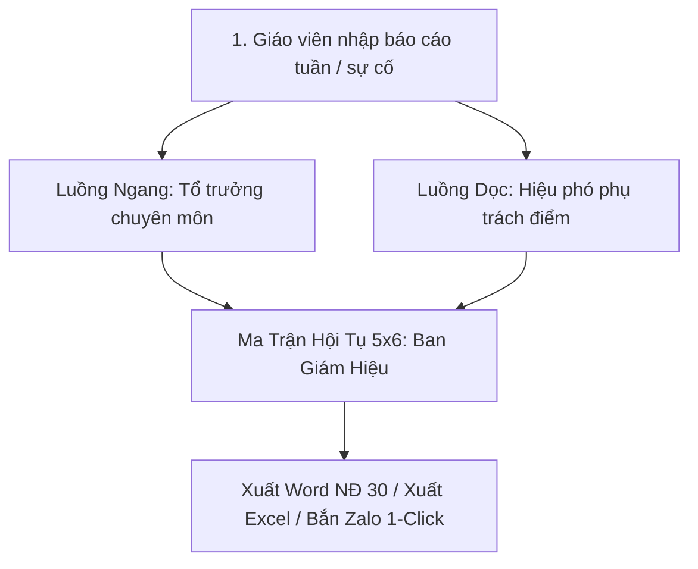

# SynchroEdu 🎓🏫
### Nền Tảng Quản Trị Sinh Hoạt Chuyên Môn Số & Báo Cáo Ma Trận 2D Cấp Tiểu Học

[](https://github.com/Chauphan708/SynchroEdu/actions/workflows/ci.yml)
[](https://github.com/Chauphan708/SynchroEdu/actions/workflows/deploy-pages.yml)
[](LICENSE)
[](manifest.json)
[](DEPLOY_0_DONG.md)
[](HUONG_DAN_SU_DUNG.md)

---

## 📖 GIỚI THIỆU TỔNG QUAN

**SynchroEdu** là giải pháp chuyển đổi số toàn diện cho trường Tiểu học có quy mô nhiều phân hiệu (1 Điểm trung tâm + 4 Điểm lẻ; 32 lớp học, 32 giáo viên). Hệ thống hợp nhất trọn vẹn hai trụ cột chiến lược:
1. **Sổ tay Quản trị Sinh hoạt Chuyên môn Số (E-EduSHCM)** bám sát [Công văn số 4069/BGDĐT-GDPT](https://moet.gov.vn) & [Thông tư số 27/2020/TT-BGDĐT](https://moet.gov.vn).
2. **Kiến trúc Báo cáo Ma trận 2D & Thông báo Tức thì (School Matrix Reporting Architecture)**: Giáo viên chỉ nhập liệu **1 lần**, hệ thống tự động phân tách thành **2 luồng đồng bộ** (ngang cho Tổ trưởng, dọc cho Hiệu phó điểm) và **hội tụ tại Ma trận 5x6** cho Ban Giám Hiệu.

---

## 🏛️ CHUẨN HÓA VĂN BẢN QUY PHẠM PHÁP LUẬT

| Văn bản pháp lý | Yêu cầu cốt lõi | Cách SynchroEdu đáp ứng |
| :--- | :--- | :--- |
| **Công văn 4069/BGDĐT-GDPT** | Sinh hoạt chuyên môn theo nghiên cứu bài học 4 bước; Tập trung vào việc học của học sinh; **Tuyệt đối không đánh giá, xếp loại người dạy**. | Bảng điện tử 4 bước có đồng hồ đếm ngược; AI tóm tắt biên bản; Banner cam kết sư phạm không xếp loại giờ dạy. |
| **Thông tư 27/2020/TT-BGDĐT** | Đánh giá học sinh tiểu học theo 3 mức độ nhận thức (Mức 1: Biết, Mức 2: Hiểu, Mức 3: Vận dụng). | Ngân hàng câu hỏi ma trận đề kiểm tra phân loại rõ ràng 3 mức độ cho toàn bộ 13 môn học. |
| **Nghị định 30/2020/NĐ-CP** | Thể thức và kỹ thuật trình bày văn bản hành chính (Quốc hiệu, Tiêu ngữ, Tên cơ quan, Khung chữ ký). | Tích hợp xuất tệp Word (`.docx`) và in A4 trực tiếp chuẩn quy cách văn bản hành chính nhà nước. |

---

## 🚀 CÁC TÍNH NĂNG NỔI BẬT

### 1. Luồng Báo Cáo Ma Trận Hội Tụ 2D (5x6)


### 2. Bộ 10 Phân Hệ Chức Năng Hoàn Chỉnh
- **Phân hệ 1 - Bảng điều khiển BGH & Ma trận 5x6**: Giám sát tức thì 5 phân hiệu x 6 khối tổ chuyên môn.
- **Phân hệ 2 - Báo cáo 3 Tab cho Giáo viên**: Tab 1 (Chuyên môn & Học sinh cần hỗ trợ) - Tab 2 (Cơ sở vật chất & Thiết bị có camera đính kèm) - Tab 3 (Kiến nghị đề xuất).
- **Phân hệ 3 - Phân luồng Ngang (Tổ trưởng & Tổ phó)**: Duyệt tiến độ bài dạy, **Công tắc ủy quyền điều hành** (Delegation Toggle) cho phép Tổ phó thay mặt phê duyệt khi Tổ trưởng vắng mặt.
- **Phân hệ 4 - Phân luồng Dọc (Hiệu phó điểm trường)**: Tiếp nhận báo cáo thiết bị, sĩ số, điện nước tại từng điểm trường lẻ để xử lý trong 24h.
- **Phân hệ 5 - Hàng đợi phản hồi nhanh (30 giây & 1-chạm 5 giây)**: Phản hồi nhanh *"Lớp không có đối tượng cần hỗ trợ"* chỉ với 1 cú chạm.
- **Phân hệ 6 - Giám sát tiến độ 32 giáo viên & Zalo 1-Click**: Tự động tính số phút trễ hạn (Grace period); Bắn thông báo nhắc nộp bài qua Zalo cho từng cá nhân hoặc toàn bộ người trễ chỉ với 1 click.
- **Phân hệ 7 - Kho học liệu số 13 môn + Dạy học Buổi 2**: Đầy đủ 13 môn Tiểu học (Toán, Tiếng Việt, Đạo đức, HĐTN, Khoa học, Lịch sử & Địa lí, TN&XH, Công nghệ, Tin học, Tiếng Anh, Âm nhạc, Mĩ thuật, GDTC) và chuyên đề Buổi 2 (STEM, Văn hóa đọc).
- **Phân hệ 8 - Sinh hoạt chuyên môn 4 bước theo CV 4069**: Xây dựng kế hoạch - Dạy minh họa quan sát - Thảo luận chia sẻ - Áp dụng thực tiễn với AI gợi ý tóm tắt biên bản.
- **Phân hệ 9 - Cổng tra cứu Cụm chuyên môn qua Mã QR**: Khách mời các trường bạn mở Camera Zalo quét mã là xem ngay KHBD và gửi góp ý trực tiếp.
- **Phân hệ 10 - Xuất báo cáo đa định dạng**: Xuất Word (`.docx`), xuất Excel (`.xlsx` SheetJS) và In ấn A4 trực tiếp.

---

## 📁 CẤU TRÚC THƯ MỤC DỰ ÁN

```text
synchroedu/
├── .github/
│   └── workflows/
│       ├── ci.yml                 # Tự động kiểm thử (Node 18, 20, 22)
│       └── deploy-pages.yml       # Tự động triển khai lên GitHub Pages
├── .gitignore                     # Cấu hình bỏ qua tệp tạm, logs, node_modules
├── CHAY_UNG_DUNG.bat              # Tiện ích mở nhanh web trên Windows (1-click)
├── DEPLOY_0_DONG.md               # Sổ tay hướng dẫn đưa lên Vercel & Supabase miễn phí
├── HUONG_DAN_SU_DUNG.md           # Hướng dẫn chi tiết cho từng vai trò người dùng
├── LICENSE                        # Giấy phép nguồn mở MIT
├── package.json                   # Cấu hình gói dự án Node.js
├── README.md                      # Tài liệu tổng quan dự án
├── index.html                     # Giao diện SPA / PWA đầy đủ 10 phân hệ
├── manifest.json                  # Cấu hình cài đặt App di động (PWA Manifest)
├── sw.js                          # Service Worker đệm offline & Web Push
├── server.mjs                     # Máy chủ HTTP Node.js native (Zero dependency)
├── supabase_schema.sql            # CSDL 12 bảng, Triggers, RLS & Seed data 32 GV
├── test_verify.mjs                # Bộ kiểm thử tự động toàn diện (36 test cases)
└── xem_phac_thao_giao_dien.html   # Phòng trưng bày 6 bản vẽ thiết kế độ nét cao
```

---

## ⚡ HƯỚNG DẪN KHỞI CHẠY CỤC BỘ (LOCAL SETUP)

### Cách 1: Sử dụng tệp mở nhanh (Windows)
Nhấp đúp chuột vào tệp:
```cmd
CHAY_UNG_DUNG.bat
```
*(Hệ thống sẽ tự khởi chạy máy chủ và tự động mở trình duyệt tại `http://localhost:3000`)*

### Cách 2: Dùng lệnh Node.js
Yêu cầu: Đã cài [Node.js](https://nodejs.org) (v18 trở lên).
```bash
# 1. Khởi chạy máy chủ
npm start
# Hoặc: node server.mjs

# 2. Mở trình duyệt truy cập:
http://localhost:3000
```

### Cách 3: Chạy bộ kiểm thử tự động
```bash
npm test
# Hoặc: node test_verify.mjs
```
Kết quả kiểm thử: **36/36 bài kiểm thử ĐẠT CHUẨN (100% PASS)**.

---

## ☁️ HƯỚNG DẪN TRIỂN KHAI MIỄN PHÍ 0 ĐỒNG TRỌN ĐỜI

Hệ thống được thiết kế với tiêu chí **Zero Cost Stack** (Không tốn 1 đồng chi phí duy trì):

### 1. Triển khai Web miễn phí qua GitHub Pages
1. Đẩy mã nguồn lên GitHub theo hướng dẫn bên dưới.
2. Vào tab **Settings** của kho lưu trữ trên GitHub -> **Pages**.
3. Tại mục **Build and deployment > Source**, chọn **GitHub Actions**.
4. GitHub Actions sẽ tự động chạy quy trình `deploy-pages.yml` và cung cấp đường dẫn:
   `https://<ten-tai-khoan>.github.io/<ten-repo>/`

### 2. Triển khai Web miễn phí qua Vercel
1. Đăng nhập [Vercel.com](https://vercel.com) bằng tài khoản GitHub.
2. Bấm **Add New... > Project** và chọn kho lưu trữ `synchroedu`.
3. Bấm **Deploy** (Vercel tự động nhận diện `index.html` tĩnh và triển khai trực tiếp từ CDN toàn cầu).

### 3. Thiết lập Cơ sở dữ liệu qua Supabase
1. Tạo dự án miễn phí tại [Supabase.com](https://supabase.com).
2. Mở **SQL Editor**, dán toàn bộ nội dung tệp [`supabase_schema.sql`](supabase_schema.sql) và bấm **Run**.
3. CSDL 12 bảng, Triggers tự động tính trễ hạn và tài khoản 32 giáo viên sẽ được khởi tạo hoàn tất.

Chi tiết xem tại tài liệu: [`DEPLOY_0_DONG.md`](DEPLOY_0_DONG.md).

---

## 📤 HƯỚNG DẪN ĐẨY DỰ ÁN LÊN GITHUB

Mở cửa sổ dòng lệnh tại thư mục dự án và thực hiện các bước sau:

```bash
# 1. Khởi tạo kho lưu trữ git cục bộ (đã thực hiện sẵn)
git init

# 2. Thêm tất cả tệp tin vào staging
git add .

# 3. Tạo commit
git commit -m "feat: cap nhat thuong hieu SynchroEdu v5.0.0 hoan chinh"

# 4. Đổi tên nhánh mặc định thành main
git branch -M main

# 5. Liên kết với kho lưu trữ trên GitHub của bạn
# (Thay your-username bằng tài khoản GitHub của bạn)
git remote add origin https://github.com/Chauphan708/SynchroEdu.git

# 6. Đẩy mã nguồn lên GitHub
git push -u origin main
```

---

## 📄 GIẤY PHÉP (LICENSE)

Dự án được phân phối theo giấy phép nguồn mở **MIT License**. Bạn được toàn quyền sử dụng, tùy chỉnh và nhân rộng miễn phí cho các trường học và ngành giáo dục.
